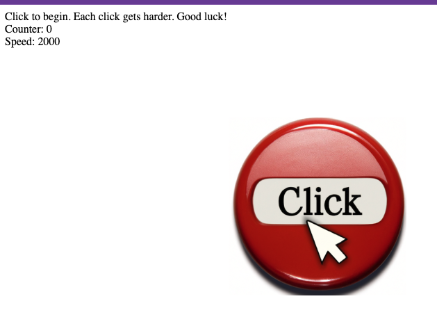
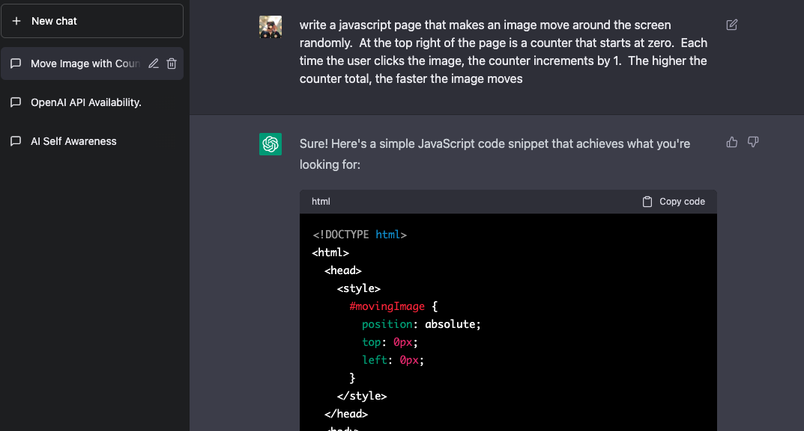
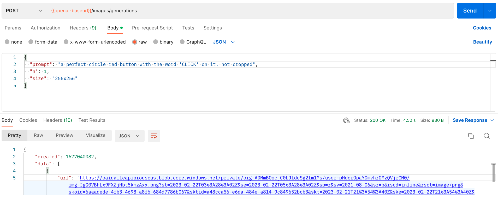

# A Small Game Built (mostly) By ChatGPT

This directory contains the script and image I got back from ChatGPT given the following prompts.  For this test, I wanted to create a simple game where the user will click a button and the button will move every 2 seconds (2,000 milliseconds).  Each time the user clicks on the button, it will increment a counter (to keep score) and speed up movement by 50 milliseconds.  As with anything AI, your results may vary.  In this case, it got me pretty close and then I made a few small changes to make it work properly and closer to what I had envisioned.

Let's take a look at results and then the workflow.

----

## Results
Here's what the game looks like:



[Click here to start the game](./click.html)


----

## Workflow
First, we used the chat interface to ask for the code needed.  Here's what I typed in:

```write a javascript page that makes an image move around the screen randomly.  At the top right of the page is a counter that starts at zero.  Each time the user clicks the image, the counter increments by 1.  The higher the counter total, the faster the image moves```



...and it explained what the code does:

```
This code creates an HTML page with an image and a counter. The image moves randomly around the screen, and every time the user clicks on it, the counter increments by one. The higher the counter, the faster the image moves. The code achieves this by using two setInterval() functions, one to move the image every 10 milliseconds, and another to update the speed every second.

Note that the code uses window.innerWidth and window.innerHeight to get the dimensions of the screen. It also uses the addEventListener() method to listen for events such as clicks and window resizes. Finally, the code uses the style property to change the position of the image.
```

This was a good start, but it was starting the speed at 1 millisecond, so I asked for a small correction:

```make the speed start at 2 seconds and decrement by 50 milliseconds each time the image is clicked```

It complied and even explained the changes AND added a safety check I would have figured out in a few minutes, but now didn't have to even think about:

```
The main change is that we've updated the speed variable to start at 2000 milliseconds (2 seconds) instead of 1. We then decrement speed by 50 milliseconds every time the image is clicked. We've also added a check to ensure that speed does not go below 50 milliseconds.

Additionally, we've updated the second setInterval() function to set the minimum value of speed to 50 milliseconds, in case it gets too low due to rapid clicks.
```

Great.  After testing, I found that it didn't fully work as expected, but here's where it was less effort to just tweak the code than to try to perfectly word-craft the changes I needed, so I did that.

----

## Optional Workflow Step

The resulting code was using a random image generation server to send us back a small random image, which is better than nothing, but I wanted a button - and an excuse to use the image generation API endpoint, so here's a phrase I bet you don't often hear: I fired up Postman to generate a button image.  Before you can start using the API, you'll need to [generate an API key](https://platform.openai.com/account/api-keys) which will require you to create an account if you don't already have one.



The first try at this failed because I aked for a 200x200 image and got back an error indicating their specific image size allowances.  I went with 256x256 and hated the result, so I updated my prompt in ask for a button that was :

```a perfect circle red button with the word 'CLICK' on it, not cropped```

The result was just shy of perfect, which is good enough for a simple example app like this.