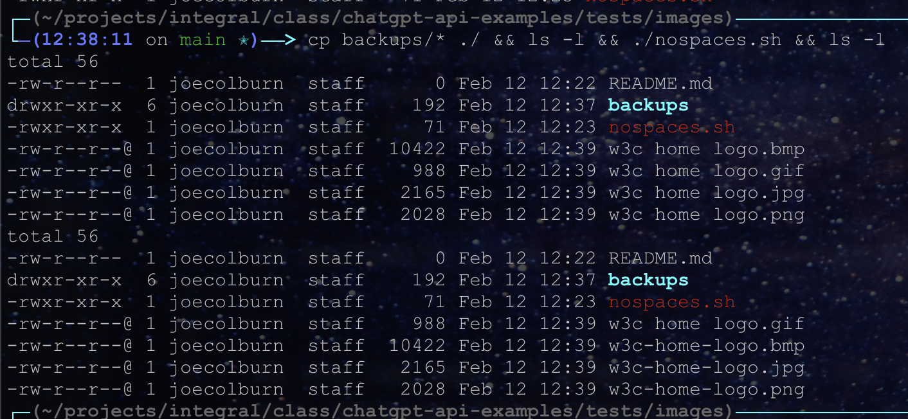

# Image Rename Script from ChatGPT

This directory contains the script I got back from ChatGPT given the prompt shown in the [models summary page](../../models.md) as well as a directory of images to test with.  To try it out, just run the following command which will copy the images to this directory, list them so you can see the file names before the script runs, run the script, and then list again so you can see the results.

```
cp backups/* ./ && ls -l && ./nospaces.sh && ls -l
```

As you can see, it properly renames the jpg, bmp, and png, because that's what we asked for, but not the gif.



You can clean up with:

```
rm w3c*
```